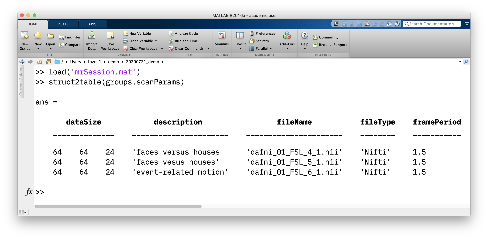

# The GUI

<center>

</center>

## Notes

The gui is a convenient way of interacting with the data for a particular session

- in the `nifti` files in subfolders
- in metadata stored in the variables `groups` and `session` that are stored in the `mrSESSION.mat` file
- in metadata stored in other files (e.g. motion comp matrices, alignment info, etc.) that cannot be stored in `nifti` files.

### mrSESSION.mat

```matlab
load('mrSession.mat')
% info about the sesion in a struct
session
```

Simply the metadata that was entered at the `mrInit()` step - but in a convenient `struct` and needed so `mrTools` code can pick this up in various steps internally.

```text
>> session

session = 

    mrLoadRetVersion: 4.7000
         description: 'demo analysis'
             subject: 'S1'
            operator: 'ds'
              magnet: 'Allegra 3T'
                coil: 'LifeService'
            protocol: 'cbi_ep2d_bold: '
```

Information about `groups` contains some more useful info about the scans stored in the `Raw` group. More on how data is stored in `groups` [on this page](03-data-model.md).

```matlab
% info about "groups"
groups
% and turn parameters of scans into table for display
struct2table(groups.scanParams)
```

<center>

</center>
