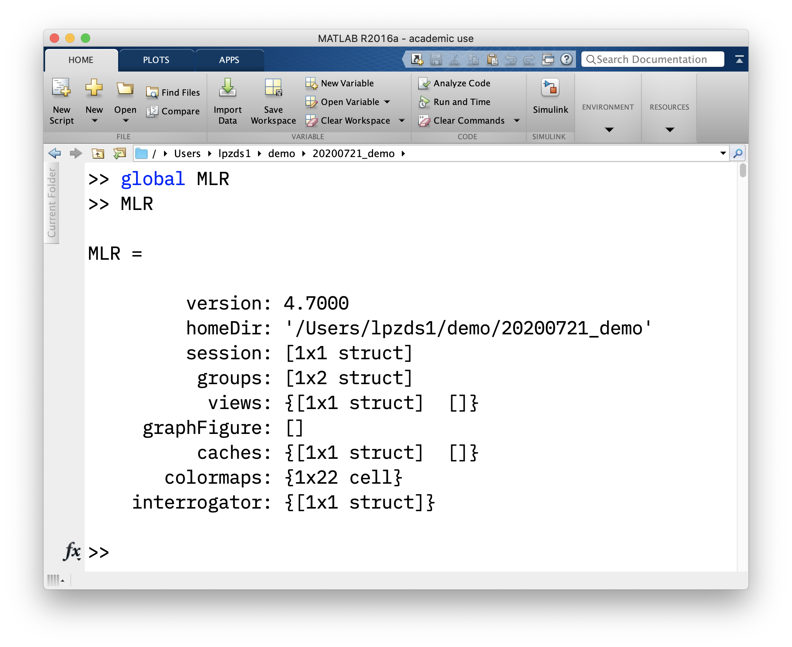

# `view` and getting/setting data

There is a really good summary of the data `view` idea on [this scripting overview page](http://gru.stanford.edu/doku.php/mrtools/scriptingoverview). Once you have got your head around the concepts in there, you can also have a look at [an example of how to set up your analysis as a script](http://gru.stanford.edu/doku.php/mrtools/scriptingexamplesretinotopy), avoiding repetitive, interactive script.

We will implement a sample analysis along these lines in one of the later units.

## accessing the `view`

In the first example below, we obtain all the overlay data that was calculated by the `timeSeriesStats` analysis and stored.

The code assumes that the `timeSeriesStats` analysis is loaded and that we want the data for the currently selectd Group but for all scans. (If you go through the code carefully, you will see that we don't specify the scan number, group number, .... and so by default, the *currently selected* scan, group, ... is used).

Check `viewGet([], 'overlays', '?')` for more detail.

The examples here are also included in the m-file on github ([dataViewExamples_04.m](./dataViewExamples_04.m))

### Example 1

```matlab
% check that workspace is empty
% should return nothing
whos

% open a mrLoadRet window and capture
% the resulting view strcut in `v`
v = mrLoadRet()

% check what overlays are available and
% what they are called

overlayNames = viewGet(v,'overlaynames')
% a cell array with the names

% and the actual overlay data
overlays = viewGet(v,'overlays')
% a struct array with all the data for those overlays!

% e.g. visualise overlay data from 
% overlay 1
figure()
curScan = viewGet(v,'currentscan')
montage( permute(overlays(1).data{curScan}, [1 2 4 3])); % data needs to be x-by-y-by-1-by-z
colormap( overlays(1).colormap)
caxis( overlays(1).colorRange)
title([overlays(1).function, ', map: ', overlays(1).name])
```

### Example 2

How to get hold of the `view` variable if you don't capture it at the start:

```matlab
% get the numbers for all active views
vnum = viewGet([], 'viewnums')

% use the first of these numbers
% (usually with the value 1) to get 
% the view itself
v = viewGet([], 'view', vnum)

% now continue as before
```
 
### Example 3

Starting out with a non-interactive ("blank") `view` and loading in analyses, data, etc. - as per Justin Gardner's scripting tutorial you can do the following 

**to be completed w/ code**

- create a *new* view (calling)
- populate with data you need (compute, or load pre-computed)
- set parameters (scan, group, etc)
- get more data
- save out / run additional analyeses


## the `mrLoadRet` global variables

`mrLoadRet` defines some global variables that make key information available about the current analysis session (and also allows for juggling more than one view at a time). These are defined in a script called `mrGlobals` which runs at startup of `mrLoadRet`. By default they don't show up in the Matlab workspace, but there is a way to reveal them.

If you want to see how `mrLoadRet` is initialised, you can have a look at the code with `edit mrGlobals`.

You should not need to access any of this information directly, but it's interesting to see how some of the functionality is implemented (eg keeping track of state, caching to speed things up, ...)

```matlab
global MLR
global mrDEFAULTS
```

<center>

</center>

## Video timestamps

- 1:10 diagram / explaining `view`, getter and setter methods
- 5:02 in practice in matlab window with `mrLoadRet`
- 8:40 getting the `viewnum` and then the `view
- 12:30 how to query parameters from `view`
- 17:00 a potential gotcha when working with `views` and the `mrLoadRet` GUI window at the same time.
- 19:15 pointers to excellent material on http://gru.stanford.edu
