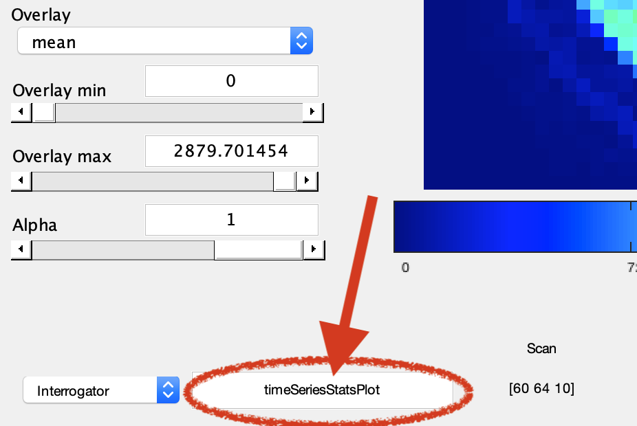
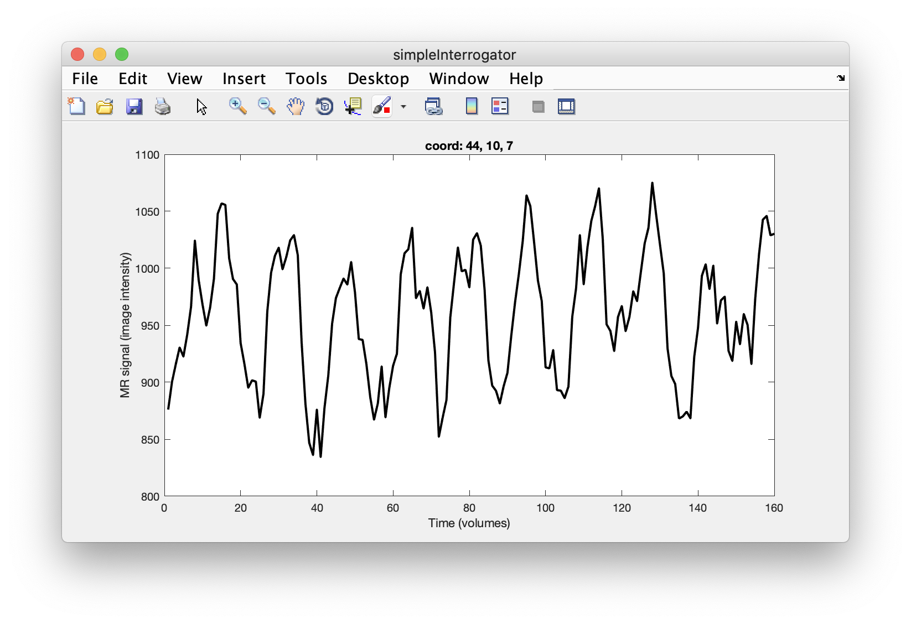

# Interacting with the dataset

We already touched on how to navigate around the dataset, through slices, scans, groups and across different statistical overlays (that can come from different analyses).

There is one particularly nice functionality in `mrLoadRet` which allows you to execute code at when the user clicks on voxels in the GUI window. This idea is called the `interrogator`.

You can toggle the `interrogator` on and off (Menu bar: **Plots->Interrogate Overlay**), to avoid running code when you didn't really mean to. When the `interrogator` is switched on, there is a text field in the bottom left of the GUI window:

<center>

</center>

## How this works

Whenever the user clicks on a valid voxel location in the data viewer window, the matlab function that's indicated in the text field is executed. The `mrLoadRet` window calls the function with the following input arguments (ie, it passes this information on to the function)

```text
v - the view
overlayNum - which overlay was selected 
scan - which scan was selected
x,y,s (coordinates) - where did the user click in viewer window
roi - if a region of interest (ROI) is present, details
    - if no ROI present, the empty
```

The matlab file [blankInterrogator.m](./blankInterrogator.m) gives you a blank canvas for trying out your own function here -- or you can have a look at the [simpleInterrogator.m](./simpleInterrogator.m) file which has the finished, minimal interrogator function I wrote in the youtube video. (Remember that you have to save these files on your matlab path / or add the location of the `intro-to-mrtools` repo to the path with the function `addpath()`).

<center>

</center>