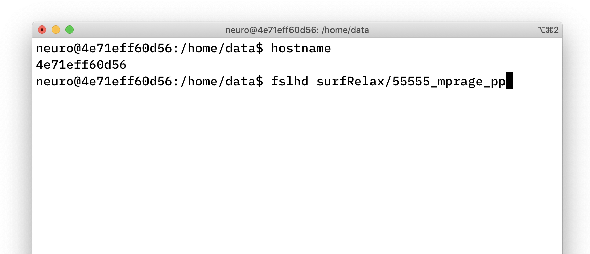

# Transforms, more on alignments



## Background

:books: Before reading on here, I strongly suggest you read the [coordinate transforms tutorial](http://gru.stanford.edu/doku.php/mrtools/coordinatetransforms) on Justin Gardner's webpage. This explains in excellent detail how coordinate transforms work and how they are handled in `mrTools`.

Below, I will try to break down the linear algebra a bit more with a worked example on point, but if you want to have some generic background on vectors and matrices, you can also check out some online material first[^0]. 

## Coordinate frames

In `mrTools` (et al), the `qform` matrix specifies how to move from the coordinate frame of the images (in `voxels`) in the image into the space of the scanner (in `mm`). The `sform` is used to specify transforms into a standard space (usually the participants anatomical image, but could be something like Talairach or MNI space, too).

### Example from the anatomy file

To get the `qform` matrix from the file you can use the `mrTools` functions:

```matlab
hdr = mlrImageReadNiftiHeader('../surfRelax/55555_mprage_pp.hdr')
hdr.qform44
```

gives you:

```text
>> hdr.qform44

ans =

    1.0000   -0.0000   -0.0000  -92.3241
   -0.0000    1.0000   -0.0000 -411.1006
    0.0000    0.0000    1.0000  107.8069
         0         0         0    1.0000
```

What do these numbers mean? They specify a linear transformation of points from one coordinate frame to another.

The qform matrix is of the following form, where the top 3-by-3 block ($r_{ij}$) is a combination of roation and scaling (and shear), and the 3-by-1 column on the right $[t_x, t_y, t_z]'$ represents translation.

$$
\mathbf{Q} = \left( \begin{array}{rrrr}
r_{11} & r_{12} & r_{13} & t_x  \\
r_{21} & r_{22} & r_{23} & t_y  \\
r_{31} & r_{32} & r_{33} & t_z  \\
0 & 0 & 0 & 1 \\
\end{array} \right)
$$


Consider a coordinate in your image `myPoint=[120; 90; 30]`. These index your image along `x`, `y` and `z` dimensions[^1]. What directions do  `x`, `y`, and `z` actually map to? And where does that 3d point in your image actually map to in actual space in the scanner, wher the images were collected?

The answer lies in the 4-by-4 matrix, which combine a rotation (and shears) and translation and indicate how a point in the image coordinate frame (voxel number along `x`, `y` and `z` in your data) can be translated into scanner space. To use these matrices we need to convert the point into **homogeneous** coordinates by adding a forth row that contains the value 1 (some nitty-gritty here worth exploring if you want to find out more - lots of materials on "homogeneous coordinates" online.)

$$
\textbf{myPoint} =\left( \begin{array}{r}
120 \\
90 \\
30 \\
1
\end{array} \right)
$$


To do the linear transformation of your point `myPoint` from above, you pre-multiply the point with the $Q$ matrix:

$$
\mathbf{Q}\cdot\textbf{myPoint} = \left( \begin{array}{rrrr}
    1.0000  & -0.0000  & -0.0000 &  -92.3241 \\
   -0.0000  &  1.0000  & -0.0000 & -411.1006 \\
    0.0000  &  0.0000  &  1.0000 &  107.8069 \\
         0  &       0  &       0 &    1.0000
\end{array} \right) 
\left( \begin{array}{r}
120 \\
90 \\
30 \\
1
\end{array} \right) =  
\left( \begin{array}{r}
27.6759  \\
-321.1006 \\
137.8069 \\
1.0000 
\end{array} \right)  
$$

To take your point back from the scanner coordinate frame into the image coordinate frame, you use the inverse matrix, $Q^{-1}$, and you should end up in the place you started with.

The example transform here is a *translation only*, so it's easier to see how $Q$ and $Q^{-1}$ are related...

```matlab
cd ~/demo/20200721_demo % or where you stored your example
% use mrTools helper function to get header
hdr = mlrImageReadNiftiHeader('../surfRelax/55555_mprage_pp.hdr')
Q = hdr.qform44
myPoint = [120;90;30] % 3d coordinate
myPoint = [120;90;30;1] % "homogeneous" version
newPoint = Q * myPoint % point in other coordinate frame
inv(Q)
newPoint = Q * myPoint
inv(Q) * newPoint % should match where we started
```

## Side-note: applying the transforms / interpolation

The `qform` and `sform` matrices represent the rules for going between the different coordinate frames. But how can you move an image from one coordinate frame into another (so that e.g. objects contained in them can be exactly superimposed on the same pixel grid)?

The answer is to apply the transformation and *resample* the image to the space you want to use. Have a look at the following example - in 2d - that explains what's going on:

```matlab
% 2d linear transformation example
% to come
```


## Notes on coordinate systems, "LPI"

The `fsl` command line tool `fslhd`  shows you the mapping of axes in the coordinate system:

```bash
fslhd surfRelax/55555_mprage_pp
```


The naming convention for this is derived from the *starting* side of each axis **FROM**

- `x` from left to right (**L**)
- `y` from posterior to anterior (**P**)
- `z` from inferior to superior (**I**)

... leading to **LPI**. Somewhat confusingly, people also use the term **RAS** for this (if you think about the directions in terms of where they are heading **TO**).[^2]

This LPI coordinate system is "right-handed" - if the idea of "handedness" is new to you have a look [at eg this video on Udacity](https://www.youtube.com/watch?v=Ke3h7NRLi2M), which explains it nicely.

## Running FSL in docker container

### `fslorient` to get orientation information

The unix command line version of getting a `qform` using `fslorient` would be:

```bash
fslorient -getsform surfRelax/55555_mprage_pp
# or niceley formatted 
fslorient -getsform surfRelax/55555_mprage_pp | xargs -n 4
```

If you are tied to a Windows machine, then you might want to run `fsl` in a docker container to make your life a bit easier. I have put together a [series of videos](https://www.youtube.com/playlist?list=PLCZfmSQp7dzKdvEf5TP4erdlDZPkqFl20)

```bash
# in Windows Terminal
cd demo # or where you keep the data for this tutorial
docker run --rm -it \
  --name fsl_dev \
  --mount type=bind,source="$(pwd)"/testdata,target=/home/data \
  docker.pkg.github.com/schluppeck/dockerize-analysis/nipype_test:1.0 \
  bash
```

Then you can run `fsl` commands by looking in the `/home/data` folder:



## Notes

[0^]: [Khan Academy: matrices and vectors](https://www.khanacademy.org/math/precalculus/x9e81a4f98389efdf:matrices/x9e81a4f98389efdf:matrices-as-transformations/v/transforming-position-vector)
- https://en.wikipedia.org/wiki/Homogeneous_coordinates

[^1]: small gotcha here, which Justin G explains on his coordinate transform tutorial. Origins of coordinate frames are at `[0;0;0]`, but Matlab uses 1-indexing, so images start at `[1;1;1]` - there is a correction for this with an extra translation matrix.

[^2]: some useful notes on orientations, handedness and related issues [on this webpage / blog](http://www.grahamwideman.com/gw/brain/orientation/orientterms.htm)

