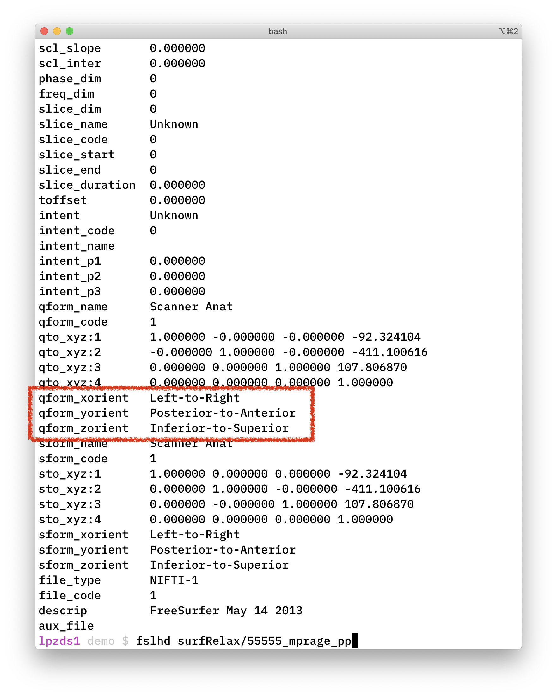

# Transforms, more on alignments



## Background

:books: Before reading on here, I strongly suggest you read the [coordinate transforms tutorial](http://gru.stanford.edu/doku.php/mrtools/coordinatetransforms) on Justin Gardner's webpage. This explains in excellent detail how coordinate transforms work and how they are handled in `mrTools`.

Below, I will try to break down the linear algebra a bit more with a worked example. We'll use 2d images to start, as this makes creating diagrams and plots a bit easier -- but the principles apply in 3d, too.

## Coordinate frames

In `mrTools` (et al), the `qform` matrix specifies how to move from the coordinate frame of the images (in `voxels`) in the image into the space of the scanner (in `mm`).

### Example from the anatomy file

To get the `qform` matrix from the file you can use the `mrTools` functions:

```matlab
hdr = mlrImageReadNiftiHeader('../surfRelax/55555_mprage_pp.hdr')
hdr.qform44
```

gives you:

```
>> hdr.qform44

ans =

    1.0000   -0.0000   -0.0000  -92.3241
   -0.0000    1.0000   -0.0000 -411.1006
    0.0000    0.0000    1.0000  107.8069
         0         0         0    1.0000
```

$$
M = \left( \begin{array}{ccc}
x_{11} & x_{12} & \ldots \\
x_{21} & x_{22} & \ldots \\
\vdots & \vdots & \ldots \\
\end{array} \right)
$$


What do these numbers mean? Consider a coordinate in your image `xyz=[120; 90; 30]`... how do we know what the dimensions `x`, `y`, and `z` actually refer to?

The `fsl` command line tools have a very helpful addition in their implementation of `fslhd` which shows you the mapping of axes in the coordinate system:

```bash
fslhd surfRelax/55555_mprage_pp
```




## Running FSL in docker container

### `fslorient` to get orientation information

The unix command line version of getting a `qform` using `fslorient` would be:

```bash
fslorient -getsform surfRelax/55555_mprage_pp
# or niceley formatted 
fslorient -getsform surfRelax/55555_mprage_pp | xargs -n 4
```

If you are tied to a Windows machine, then you might want to run `fsl` in a docker container to make your life a bit easier. I have put together a [series of videos](https://www.youtube.com/playlist?list=PLCZfmSQp7dzKdvEf5TP4erdlDZPkqFl20)

```bash
# in Windows Terminal
cd demo # or where you keep the data for this tutorial
docker run --rm -it \
  --name fsl_dev \
  --mount type=bind,source="$(pwd)"/testdata,target=/home/data \
  docker.pkg.github.com/schluppeck/dockerize-analysis/nipype_test:1.0 \
  bash
```

Then you can run `fsl` commands by looking in the `/home/data` folder:


## References

- [Khan Academy: matrices and vectors](https://www.khanacademy.org/math/precalculus/x9e81a4f98389efdf:matrices/x9e81a4f98389efdf:matrices-as-transformations/v/transforming-position-vector)
- https://en.wikipedia.org/wiki/Homogeneous_coordinates