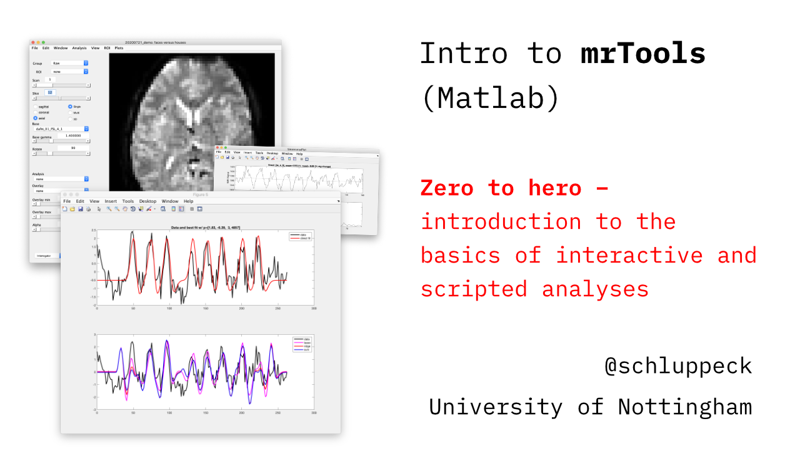

# Introduction to `mrTools`

This site provides some (self-paced) teaching material to get up to speed with `mrTools`, a set of Matlab tools for analyzing MRI data (https://github.com/justingardner/mrTools).

:memo: On some pages, there is a bit of maths / linear algebra, which shows up only when you look at the [rendered version intro-to-mrtools](https://nottingham-neuroimaging.github.io/intro-to-mrtools). You can have a look at the source materials and any code on [the github repo page](https://github.com/nottingham-neuroimaging/intro-to-mrtools).

There is a worked walk-through of an analysis of anatomical / fMRI data with a view to programming your own analysis and scripting reproducible pipelines. Along the way, we try to provide some additional info about `mrTools` internals, some programming conventions, and ideas for how you may adapt the tools for your use case.

<center>

</center>
<br>
<br>

>mrTools provides a set of Matlab tools to analyze fMRI data. It can do basic analyses like correlation analyses used in retinotopy experiments, event-related, population RF and GLM analyses. It can display the results of analyses on inplane anatomies, flat maps and surfaces. It is designed to make it easy to write your own script and programs in Matlab to analyze your data.
>http://gru.stanford.edu/doku.php/mrtools/overview
>https://www.cns.nyu.edu/heegerlab/wiki/doku.php?id=mrtools:top (mirror)
<br>
<br>

<code>
Gardner, Justin L., Merriam, Elisha P., Schluppeck, Denis, Besle, Julien, & Heeger, David J. (2018, June 28). mrTools: Analysis and visualization package for functional magnetic resonance imaging data (Version 4.7). Zenodo. http://doi.org/10.5281/zenodo.1299483
</code>

[](https://doi.org/10.5281/zenodo.1299483)

## Pre-requisites, additional reading

To make most of this material, it's a good idea to have worked through some of the tutorials hosted on Justin Gardner's (JLG) webpage:

- [**retinotopy / basics**](https://gru.stanford.edu/doku.php/mrtools/tutorialsretinotopy) / [**retinotopy / basics** (mirrored)](https://www.cns.nyu.edu/heegerlab/wiki/doku.php?id=mrtools:tutorialsretinotopy)

- [**population receptive field analysis**](https://gru.stanford.edu/doku.php/mrtools/tutorialsprf) /[**population receptive field analysis** (mirrored)](https://www.cns.nyu.edu/heegerlab/wiki/doku.php?id=mrtools:tutorialsprf)
- [**GLM / linear regression**](https://gru.stanford.edu/doku.php/mrtools/tutorialsglm_v2) / [**GLM / linear regression** (mirrored)](https://www.cns.nyu.edu/heegerlab/wiki/doku.php?id=mrtools:tutorialsglm_v2)

There is also quite detailed documentation on the code http://gru.stanford.edu/mrTools (mirrored: https://www.cns.nyu.edu/heegerlab/wiki/doku.php?id=mrtools:top)

## Downloads / installs

### Dependencies

I (@schluppeck) made the videos and materials running with
- ``Matlab R2016a`` (some known issues with later versions, e.g. `R2019a`, which are on radar)
- `macOS` v10.15.6 Catalina

- https://github.com/justingardner/mrTools (at commit: `b4330ea2` - Sat, 1 Feb 2020)
- https://github.com/justingardner/mgl (at commit: * `be40b58` - Tue, 9 Jun 2020)

### Code snippets for this tutorial

You can grab the markdown documents and data from which this webpage + tutorial is made by cloning the followowing repo:

```bash
cd ~/matlab/ # or where you want to download to
git clone https://github.com/nottingham-neuroimaging/intro-to-mrtools.git
```

## Any problems?

If you encounter any problems with the material, running it on non-`macOS` platforms, if you find bugs or have suggestions for improvements, [please file an issue](https://github.com/nottingham-neuroimaging/intro-to-mrtools/issues) on the github page.

## Videos

There is a `youtube` playlist for the videos in this series:

[Youtube playlist **intro-to-mrtools**](https://www.youtube.com/playlist?list=PLCZfmSQp7dzLeEDlONvTSsnipNlcYITCT)


| Week | Topic                                                                            |
|:-----|:---------------------------------------------------------------------------------|
| 1    | [getting started / setup / data / mrInit](01-setup.md)                           |
| 2    | [a quick look at the `mrLoadRet` gui](02-first-look-at-gui.md)                   |
| 3    | [the data model / data structures (**intro**)](03-data-model.md)                 |
| 4    | [details about data `view`s](04-data-view.md)                                    |
| 5    | [interacting with the dataset (interrogators)](05-interacting-with-data.md)      |
| 6    | [first steps with scripting](06-first-scripting.md)                              |
| 7    | [alignments / `mrAlign`  - moving between spaces](07-alignments.md)              |
| 8    | [more alignment / transforms / moving between spaces](08-transforms.md)          |
|      | ...                                                                              |
|      | making custom plots (interrogater example)                                       |
|      | finding functions / documentation  (`mrSearchHelp`, webpages, general best ways) |
|      | making use of `freesurfer segmentations` / flat maps                             |
|      | ...                                                                              |

## Data

The data for working through the materials is included in the `data` subfolder on this github repo. These were acquired during a session w/ the MSc Brain Imaging students 2017/18 (Project: *Using neuroimaging for education: fMRI, EEG and MEG (ED-NIMG)* #E11122014).

## Colophon

Written by Denis Schluppeck (started 2020-07)

- [rendered version](https://nottingham-neuroimaging.github.io/intro-to-mrtools/) for reading
- [github repo](https://github.com/nottingham-neuroimaging/intro-to-mrtools) for code/issues/pull requests

